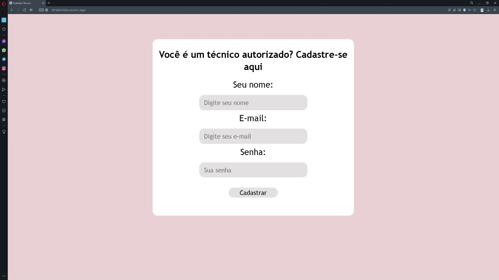
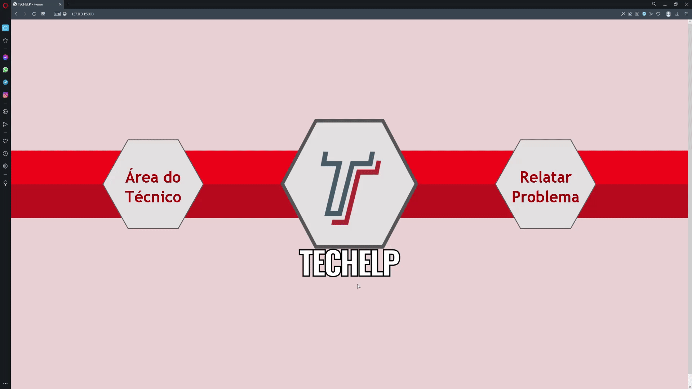
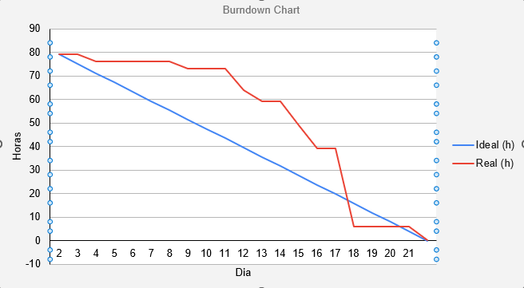

# Sprint 2 - Banco de Dados & Layout

      
      <h2 align="center"> Buzz Tech</h2>

 

  <a href ="#backlog"> Backlog da Sprint </a>  | 
  <a href ="#burndown"> Burndown </a>  |
  <a href ="#evolução"> Evolução do Backlog </a>  |
  <a href ="#hitoria"> Histórias de Usuários </a>

 

<h4 align="center">
 
 
 
 
 
 
 
</h4>

 

> Status da Sprint: Concluída :heavy_check_mark:

 

Na segunda sprint buscou-se aprimorar o produto através da criação e consolidação de um banco de dados relacional utilizando-se MySQL e Flask-SQLAlchemy. Para atingir um maior valor do produto, foram adicionadas diversas funcionalidades no produto na perspectiva da utilização do técnico. A versão sintética e funcional do um sistema foi acrescida primeiro da modelagem de um banco de dados relacional com duas entidades, relacionando as Ordens de Serviço aos  Usuários cadastrados, ou seja, os técnicos que atenderão cada ordem. Através dessa atualização, o técnico será cadastrados com usuário e senha e terá uma visão diferenciada dos chamados, podendo atualizar e deletar os registros de ordens de serviço criados no banco de dados.

Outra mudança que vale destacar é a implementação e atualização de soluções visuais que visam facilitar a utilização do sistema pelos usuários que desejarem abrir uma ordem de serviço de reclamação de problemas. O wireframe foi pensando para criar um uso mais fluido e intuitivo para os usuários. Para isso, foram utilizados  ícones, paletas de cores, bem como botões para preenchimento de algumas informações, ao invés dos formulários por escrito.

Para visualizar o *Wireframe* em PDF, acesse o [link :link:](img/wireframe.pdf).

### :bust_in_silhouette: Cadastro do técnico

### :telephone_receiver: Abertura de chamado

### 	:eyes: Visualização do chamado

 

##  :date: Backlog da Sprint

|                            Tarefa                            |                          Descrição                           |  Histórias de Usuários   | Prioridade | Sprint | Estimativa de Esforço |       Status       |
| :----------------------------------------------------------: | :----------------------------------------------------------: | :----------------------: | :--------: | :----: | :-------------------: | :----------------: |
|               Levantamento dos tipos de danos                | Listagem dos hardware integrantes das máquinas dos laboratórios passíveis de erros e má funcionamento . | <a href='#us07'>US07</a> |   Baixa    |   2    |          3h           | :white_check_mark: |
| Inserção dos principais tipos de danos de hardware no sistema | Inserção dos principais tipos de danos no sistema contendo os problemas de hardware com maior probabilidade de ocorrência. | <a href='#us07'>US07</a> |    Alta    |   2    |          9h           | :white_check_mark: |
|      Criação da Modelagem Conceitual do Banco de Dados       | Criação da Modelagem Conceitual através da descrição de como os dados serão armazenados no banco e também seus relacionamentos. | <a href='#us08'>US08</a> |    Alta    |   2    |          8h           | :white_check_mark: |
| Criação do Esquema Conceitual através do Diagrama Estrutural de Entidade Relacional (DEER) | Criação de um modelo de mais alto nível, ou seja, que esta mais próximo da realidade dos usuários. Esse modelo pode é elaborado por meio Diagrama Estrutural de Entidade e Relacionamento (DEER). | <a href='#us08'>US08</a> |    Alta    |   2    |          1h           | :white_check_mark: |
|                Criação do Banco de Dados SQL                 | Criação do Banco de Dados relacional e funcional baseado na modelagem e no esquema aprovados. | <a href='#us20'>US20</a> |    Alta    |   2    |          13h          | :white_check_mark: |
|     Funções de ligação da aplicação com o banco de dados     | Criação de funções em Python que levem os dados preenchidos pelos usuários nos campos de abertura de chamado até o banco de dados, e assim salvem esses dados de uma maneira persistida. | <a href='#us21'>US21</a> |    Alta    |   2    |          12h          | :white_check_mark: |
|                  Criação da área do Técnico                  | Criar uma área para o técnico administrar esses chamados recebidos com a entrada em ordem cronológica | <a href='#us09'>US09</a> |    Alta    |   2    |          12h          | :white_check_mark: |
| Login simplificado para o técnico e diferenciação da interface dependendo de  quem está utilizando | Possibilidade de criar usuários para o sistema de ordem de serviço para que os técnicos tenham uma maneira segura e privada de visualizar, deletar, procurar, filtrar e atualizar os chamados criados pelos usuários. | <a href='#us09'>US09</a> |    Alta    |   2    |          9h           | :white_check_mark: |
|               Implementar facilitações visuais               | Utilização de cores, ícones e outras soluções gráficas que facilitem o entendimento das informações dos sistemas para os usuários que desejem utilizá-lo. | <a href='#us17'>US17</a> |   Baixa    |   2    |          3h           | :white_check_mark: |

 

## :fire: Burndown

 

## :hatching_chick: Evolução do Backolog

Como a metodologia ágil Scrum tem como princípios a adaptabilidade e o processo iteraitvo, mudanças ocorrem para que o produto chegue ao final da Sprint com o maior valor possível. Para isto, foram necessárias alterações de tarefas que geraram 4 atualizações de versão do Backlog do Produto:

|              **Backlog 3.0**  10% █▒▒▒▒▒▒▒▒▒              |
| :----------------------------------------------------------: |
|          Levantamento e listagem dos tipos de danos          |
|      Criação da Modelagem Conceitual do Banco de Dados       |
| Criação do Esquema Conceitual através do Diagrama Estrutural de Entidade Relacionamento (DEER) |
|             Início da Criação do Banco de Dados              |
| Criação da área do Técnico para diferenciar a interface dependendo de quem está utilizando |

|               Backlog 3.22 99% ██████████]                |
| :----------------------------------------------------------: |
|          Levantamento e listagem dos tipos de danos          |
| Inserção dos principais tipos de danos no sistema em lista hardware, software, rede |
|      Criação da Modelagem Conceitual do Banco de Dados       |
| Criação do Esquema Conceitual através do Diagrama Estrutural de Entidade Relacional (DEER) |
|                Criação do Banco de Dados SQL                 |
|     Funções de ligação da aplicação com o banco de dados     |
|                  Criação da área do Técnico                  |
| Login simplista para o técnico com diferenciação da interface dependendo de  quem está utilizando |
| Implementar algumas facilitações visuais (hard, software, rede, mouse, monitor etc) |

 

## :key: Histórias de Usuário

|          ID           |                     História de Usuário                      |
| :-------------------: | :----------------------------------------------------------: |
| US07 | Como profissional de outra geração, Andréia pode ter dificuldades para relatar o problema em sua máquina, ela quer uma lista dos principais possíveis problemas para facilitar seu relato na solicitação. |
| US08 | Pedro precisa de um ambiente com sistema integrado para que seja melhor e confiável a administração das tarefas |
| US09 | Pedro necessita de uma área de acesso único para que ele visualize os pedidos de assistência e entenda sua propriedade, sem outros usuários vejam ou interferirem no fechamento dos chamados. |
| US17 | Por ser mais velha, Andréia pode ter dificuldade de entender o que está escrito ou mesmo ao que se refere cada parte da solicitação de informações. Por isso, deverá ser criada identificações visuais, facilitando a comunicação e entendimento do usuário. |
| US20 | Pedro precisa de um ambiente o qual os dados das ordens de serviço fiquem armazenados mesmo depois que sua sessão acabar. |
| US21 | Pedro precisa de uma maneira de conectar o sistema web ao o banco de dados e, a partir dessa conexão, poder inserir, deletar, procurar, filtrar e atualizar os dados registrados nesse banco de dados. |
