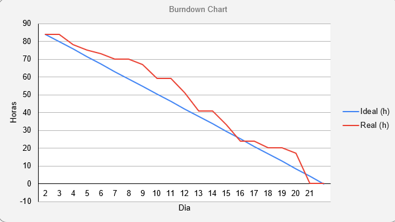

# Sprint 3 - Layout Editável

      
      <h2 align="center"> Buzz Tech</h2>

 

  <a href ="#backlog"> Backlog da Sprint </a>  | 
  <a href ="#tarefas"> Tarefas </a>  | 
  <a href ="#burndown"> Burndown </a>  |
  <a href ="#evolução"> Evolução do Backlog </a>  |
  <a href ="#hitoria"> Histórias de Usuários </a>

 

<h4 align="center">
 
 
 
 
 
 
 
 
</h4>

 

> Status da Sprint: Concluída :heavy_check_mark:

 

Para a terceira sprint o foco foi tornar o layout dos laboratórios editável, um dos requisitos mínimos para a entrega do produto. Foi utilizado JavaScript como a linguagem base para tornar o front end dinâmico e, assim, possibilitar que o técnico, quando logado, possa adicionar computadores, mesas, portas, quadros brancos e servidores. Além disso, é possível editar o nome dos computadores e alterar tamanho, posição e rotação de todos os objetos da sala. Todas essas funções são armazenadas no banco de dados, dando segurança ao técnico que suas alterações serão mantidas, além de dar a possibilidade de fazer essas alterações de qualquer computador com acesso à internet.

### 	:wrench: Layout editável

### :microscope: Layout dos laboratórios

### 	:electric_plug: Componentes editáveis

### :calling: Confirmação de chamado enviado

 

##  :date: Backlog da Sprint

|                            Tarefa                            |                          Descrição                           |               Histórias de Usuários                | Prioridade | Sprint | Estimativa de Esforço |       Status       |
| :----------------------------------------------------------: | :----------------------------------------------------------: | :------------------------------------------------: | :--------: | :----: | :-------------------: | :----------------: |
|  <a href='#enviada'>Confirmação  de solicitação enviada</a>  | Sinalizar  ao usuário solicitante da abertura do chamado quando esse chamado tiver sido  recebido pelo sistema. |              <a href='#us12'>US12</a>              |    Alta    |   3    |          7h           | :white_check_mark: |
| <a href='#CriacaoLayout'>Criação  do layout de todos os laboratórios</a> | Implementação  de todos layouts dos laboratórios utilizando o levantamento feito em sprints anteriores. | <a href='#us13'>US13</a>, <a href='#us14'>US14</a> |    Alta    |   3    |          20h          | :white_check_mark: |
| <a href='#LayoutEditavel'>Tornar  o layout dos laboratórios editável</a> | Fazer  com que o layout do laboratório possa ser editável em relação ao design e  disposição de todos os itens: computadores, mesa, servidores e lousa. | <a href='#us15'>US15</a>, <a href='#us22'>US22</a> |    Alta    |   3    |          13h          | :white_check_mark: |
| <a href='#EditarMaquinas'>Possibilitar a edição das características das máquinas</a> | Possibilitar que detalhes do computador sejam alterados e armazenados: processador, RAM e sistema operacional. |              <a href='#us23'>US23</a>              |    Alta    |   3    |          10h          | :white_check_mark: |
| <a href='#ConectarBanco'>Conectar o Banco de Dados com o layout do laboratório e informações das máquinas</a> | Criar funções para que o banco de dados consulte e persista o que o técnico salvar durante as edições de layout do laboratório, bem como as alterações das carecterísticas dos computadores. |              <a href='#us10'>US10</a>              |    Alta    |   3    |          20h          | :white_check_mark: |

 

## :checkered_flag: Tarefas

1. ### Confirmação  de solicitação enviada

   Sinalizar  ao usuário solicitante da abertura do chamado quando esse chamado tiver sido  recebido pelo sistema para melhorar compreensão de finalização do processo e diálogo com o usuário. Assim, criou-se uma rota que redireciona o usuário a uma página com uma mensagem de confirmação de envio e agradecimento quando a ordem de serviço é efetivada.

   

   

   

2. ### Criação  do layout de todos os laboratório

   Para a implementação  de todos layouts dos laboratórios utilizando o levantamento feito em sprints anteriores, criou-se a representação visual dos laboratórios com a disposição interna deste, abrangendo o posicionamento dos computadores, mesas, quadro branco e servidor. Esse processo foi feito na própria aplicação através da função e página de editar, após a conclusão da tarefa de layout editável, um dos requisitos do projeto. 
   
   

|       Laboratório grande de 32 computadores - sala 402       | Laboratório médio de 24 computadores - salas 301, 302 e 401  |
| :----------------------------------------------------------: | ------------------------------------------------------------ |
|  |  |

| Laboratório médio de 18 computadores - salas 403, 405, 406, 407, 408, 409, 411 e 412 |   Laboratório pequeno de 18 computadores - salas 303 e 404   |
| :----------------------------------------------------------: | :----------------------------------------------------------: |
|  |  |

3. ### Tornar  o layout dos laboratórios editável

   Através da descrição de como os dados serão armazenados no banco e também seus relacionamentos, bem como com diversas discussões com o cliente sobre as suas necessidades, foi feita a criação da modelagem conceitual do banco de dados relacional. Chegou-se à conclusão que, para essa atual etapa do projeto, eram necessárias apenas duas tabelas: uma para os chamados, outra para os usuários. Essa tabelas teriam cardinalidade de 1 para N, com a chave primária da tabela de usuários sendo usada como a chave estrangeira na tabela de chamados. A partir desse conceito foi esboçado o Diagrama Estrutural de Entidade Relacional que pode ser visto na próxima tarefa.

   

   

   

4. ### Possibilitar a edição das características das máquinas

   Para possibilitar que detalhes do computador sejam alterados e armazenados (processador, RAM e sistema operacional), a visualização do técnico das especificações das máquinas para o solicitante passou a ser a mesa da  da visualização do técnico, que possibilta a atualização das informações. O que diferencia as visualizações é o fato do usuário estar ou não logado. Os códigos de CSS de ambos foram espelhados para que o estilo permaneça o mesmo, independentemente das informações recebidas pelo código HTML.	

   

   

   

5. ### Conectar o Banco de Dados com o layout do laboratório e informações das máquinas

   Foram criadas funções para que o banco de dados consulte e persista o que o técnico salvar durante as edições de layout do laboratório, bem como as alterações das carecterísticas dos computadores.Isso é importante porque permite ao técnico que ele altere as informações das máquinas e o layout dos laboratórios e, a partir daí, os usuáios tenham infomações sempre atualizadas sobre cada laboratório e cada computador.

   

 

## :fire: Burndown

 

## :hatching_chick: Evolução do Backolog

Como a metodologia ágil Scrum tem como princípios a adaptabilidade e o processo iteraitvo, mudanças ocorrem para que o produto chegue ao final da Sprint com o maior valor possível. Para isto, foram necessárias alterações de tarefas que geraram 4 atualizações de versão do Backlog do Produto:

 

## :key: Histórias de Usuário

|          ID           |                     História de Usuário                      |
| :-------------------: | :----------------------------------------------------------: |
| US10 | Pedro precisa de um sistema integrado que faça a interação direta entre os chamados abertos e a  área do técnico para um fundamental bom gerenciamento do tempo e tarefas |
| US12 | Para Natália e Andréia um aviso de "confirmação de envio" da solicitação na própria página de abertura de chamados é necessário para que tenha conhecimento do envio, assim evitando que seja enviado repetidas vezes o mesmo problema, melhorando a interface com o usuário e impedindo que Pedro tenha muitos recebimentos com as mesmas solicitações. |
| US13 | Natália, aluna e Andréa, professora, precisam de uma forma de identificação visual do computador dentro do laboratório disposto para confirmar que estão falando do computador correto quando abrirem o chamado. |
| US14 | Pedro, técnico, precisa de uma identificação visual para saber exatamente qual computador está com problemas e onde está esse computador, pois isso evitará confusões e perda de tempo. |
| US15 | Para que Natália, aluna, e Andréa, professora, possam especificar para qual computador estão abrindo o chamado, é necessário que o layout das máquinas esteja ligado ao banco de dados, evitando possíveis erros de digitação e interpretação. |
| US22 | É muito importante para o cliente que o técnico Pedro possa editar facilmente a disposição dos itens dentro do laboratório de forma simples e rápida, para acompanhar possíveis mudanças físicas do laboratório em tempo real e facilitando assim que o programa apresentado para Andréia e Natália não fiquem desatualizado. |
| US23 | Pedro precisa de algumas utilidades em sua área do técnico para que haja facilidade em seu dia-a-dia de trabalho. Entre essas funcionalidades estão: layout editável e mudança da nomenclatura, pois Pedro pode um dia sentir a necessidade de mudar o nome dos computadores; características da máquina, pois Pedro pode precisar fazer alguma alteração no hardware e deixa isso detalhado. |
