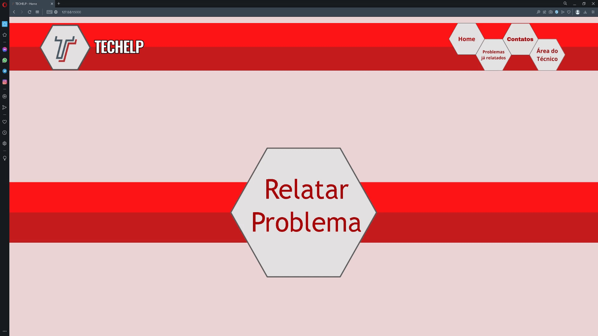
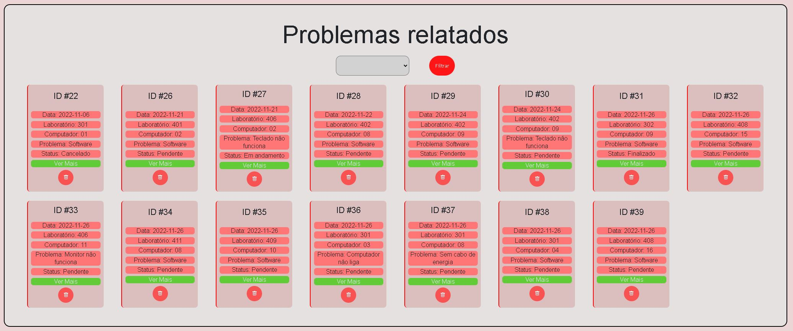
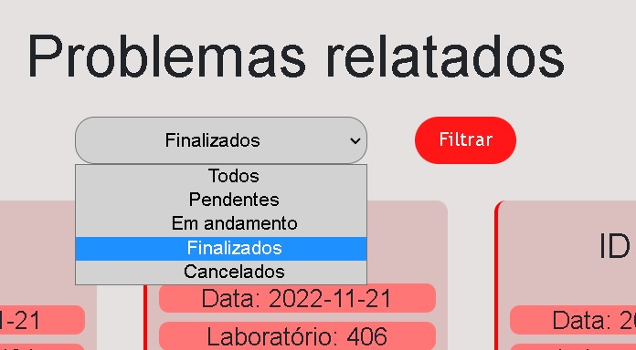
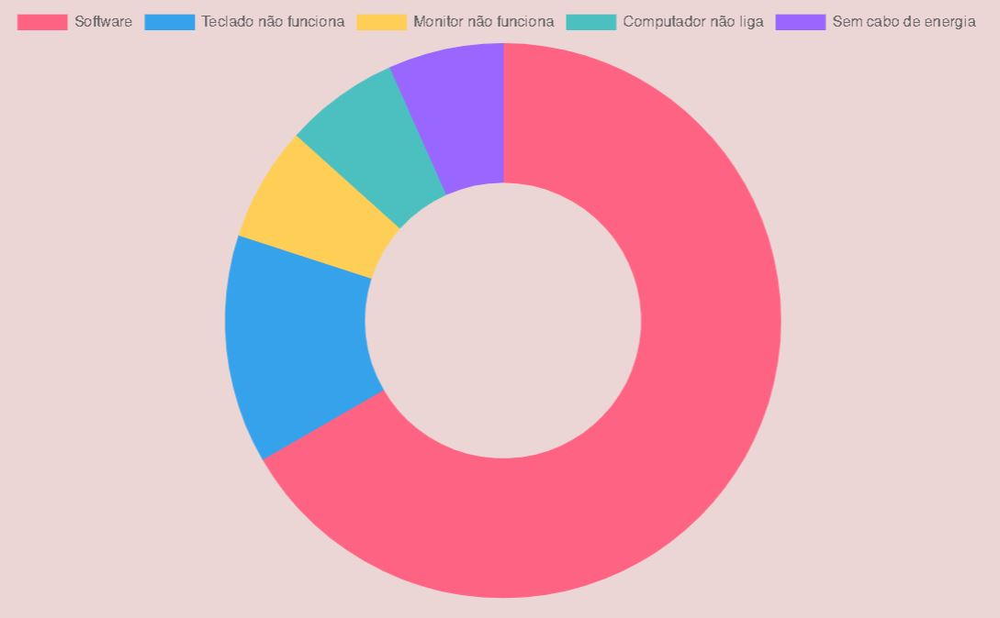
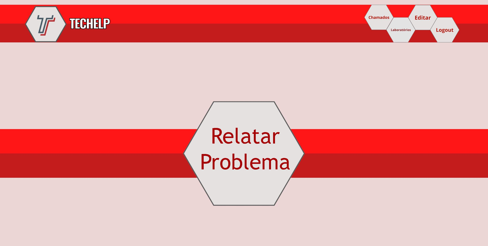
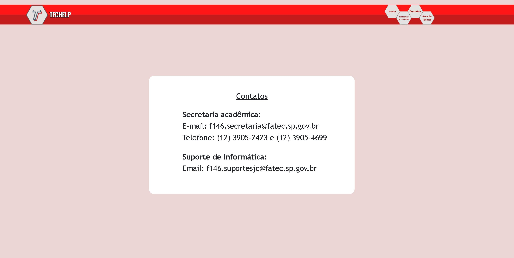
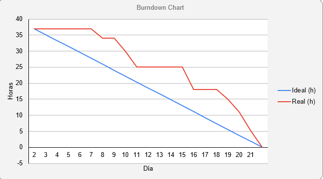

# Sprint 4 - Aprimoramentos

      
      <h2 align="center"> Buzz Tech</h2>

 

  <a href ="#backlog"> Backlog da Sprint </a>  | 
  <a href ="#tarefas"> Tarefas </a>  | 
  <a href ="#burndown"> Burndown </a>  |
  <a href ="#evolução"> Evolução do Backlog </a>  |
  <a href ="#hitoria"> Histórias de Usuários </a>

 

<h4 align="center">
 
 
 
 
 
 
 
 
</h4>

 

> Status da Sprint: Concluída :heavy_check_mark:

 

Como todas os requisitos já estavam prontos, na quarta e última sprint, o foco do time foi lapidar o produto para chegar no maior valor possível. Novas soluções visuais foram implementadas na área de visualização dos chamados, como a mudança de layout para para a forma de cards. Outra mudança visual feita na área de visualização foi quanto à análise de dados. Um gráfico com as informações sobre os chamados foi adicionado para facilitar esta análise e acompanhamento de dados. Também foi criado um filtro para que se possa selecionar os chamados por status, o que melhora organização durante o uso dessa página. Para que essa mudança tivesse alguma relevância, foi adicionada uma ferramenta para que o técnico possa mudar o status dos chamados.

Mais mudanças visuais foram feitas em outras páginas. Uma delas é a readequação do menu para atender mais funcionalidades, tanto dos usuários logados, quanto dos que não o estão. Para estes, foi adicionado um botão "Contatos" que encaminha para um página com telefone e e-mail de contato da instituição cliente. Outro botão é o de "Problemas já relatados", que dá acesso à área de visualização de chamados para os usuários que não estejam logados. Vale ressaltar que, neste caso,  usurários não podem alterar os chamados, apenas visualizá-los. Já na página home, foram retirados dois botões, deixando apenas o de "Relatar problema". Isto foi feito com o objetivo de deixar mais claro e direto possível a abertura de chamado, como ressaltado pelo cliente em todas as sprints. 

Para os usuários logados, as mudanças no menu ficaram por conta do botão "Chamados" que dá acesso para a área de visualização, o que, neste caso, possibilita a alteração dos dados. Um botão de "Laboratórios" foi adicionado para a acessar a página com as portas dos laboratórios diretamante. Também foi adicionado um botão "Editar" para que o usuário logado possa editar e/ou criar algum laboratório. E, por último, um botão de "Logout", para caso o usuário logado deseje encerrar sua sessão. 

### 	:art: Identificações visuais

### :telephone: Contatos

### 	:traffic_light: Modificar status

 

##  :date: Backlog da Sprint

|                            Tarefa                            |                          Descrição                           |  Histórias de Usuários   | Prioridade | Sprint | Estimativa de Esforço |       Status       |
| :----------------------------------------------------------: | :----------------------------------------------------------: | :----------------------: | :--------: | :----: | :-------------------: | :----------------: |
|  <a href='#idVisual'>Finalizar  identificações visuais </a>  | Criar  possibilidades visuais dessas indicações   sinalizar esses defeitos e sugerir ao cliente. | <a href='#us13'>US13</a> |    Alta    |   4    |          30h          | :white_check_mark: |
| <a href='#contatos'>Criação  de uma página de contatos </a>  | Criar  página de detalhamento da funcionalidade do sistema e uma página de contato | <a href='#us17'>US17</a> |   Baixa    |   4    |          5h           | :white_check_mark: |
| <a href='#status'>Função  de alteração do status do chamado na área do tecnico</a> | Página  home clicável com detalhamentos e página de contatos também clicável com os  meios de contato (telefone e e-mail) | <a href='#us18'>US18</a> |   Média    |   4    |          13h          | :white_check_mark: |
|           <a href='#teste'>Testes e  correções</a>           | Testes em todas as funcionalidades do sistema para identificação e correção de qualquer possível erro. |      |    Alta    |   4    |          20h          | :white_check_mark: |

 

## :checkered_flag: Tarefas

1. ### Finalizar  identificações visuais

   Para as identificações visuais foram adicionadas diversas melhorias: mudança de layout de visualização dos chamados para cards, ao invés de uma lista; filtragem de dados por status, para organizar melhor a visualização dos mesmos; gráfico para tornar visual a análise dos dados sobre os chamados; novos botões no menu para os usuários logados e não logados; limpeza da página inicial para deixar mais intuitiva a criação do chamado.

   

   |         Visualização dos chamados em layout de cards         |              Filtragem dos chamados por status               |
   | :----------------------------------------------------------: | :----------------------------------------------------------: |
   |  |  |

   |   Gráfico para análise visual dos dados sobre os chamados    |             Melhoria na página incial e no menu              |
   | :----------------------------------------------------------: | :----------------------------------------------------------: |
   |  |  |

   

   

2. ### Criação  de uma página de contatos 

   Criar  página uma página de contato com e-mail e telefone da instituição de ensino.
   
   
   
   
   
   

3. ### Função  de alteração do status do chamado na área do tecnico

   Esta função permite ao técnico alterar o status do chamado aberto pelos usuários. Na abertura do chamado, ele é automaticamente classificado como "Pendente", então a partir daí o técnico pode alterar essa classificação de status para "Em andamento", "Cancelado" e "Finalizado". É importante frisar que essa alteração é importante para que, ao filtrar os chamados, tenha-se uma visualização precisa de qual a situação dos mesmos.

   

   

   

4. ### Testes e  correções

   Esta tarefa foi realizada para certificar quanto à possibilidade de qualquer tipo de erro ou bug que pudesse ainda estar presente no sistema. Foram testadas todas as funções de maneira exaustiva em busca de qualquer tipo de erro de código que gerasse um reação inesperada pelo time de desenvolvedores e, é claro, pelo cliente e usuário do produto.

   

   

 

## :fire: Burndown

 

## :hatching_chick: Evolução do Backolog

Apesar da metodologia ágil Scrum ter como princípios a adaptabilidade e o processo iteraitvo, nessa sprint não houveram mudanças no backlog do produto. O Scrum team e cliente chegaram ao consenso que, com o backlog planejado até então seria o melhor planejamento para que o produto chegasse ao maior valor possível.

 

## :key: Histórias de Usuário

|          ID           |                     História de Usuário                      |
| :-------------------: | :----------------------------------------------------------: |
| US13 | Natália, aluna e Andréa, professora, precisam de uma forma de identificação visual do computador dentro do laboratório disposto para confirmar que estão falando do computador correto quando abrirem o chamado. |
| US17 | Por ser mais velha, Andréia pode ter dificuldade de entender o que está escrito ou mesmo ao que se refere cada parte da solicitação de informações. Por isso, deverá ser criada identificações visuais, facilitando a comunicação e entendimento do usuário. |
| US18 | Natália pode sentir a necessidade de saber quais serviços ela pode solicitar na  página. Logo, eles estarão descritos melhor na página home. Andréia pode não conseguir expressar seu problema por escrito ou não ter seu problema resolvido, logo, uma página de contato poderá ser útil para que ela  tenha notícias sobre a sua solicitação. |
